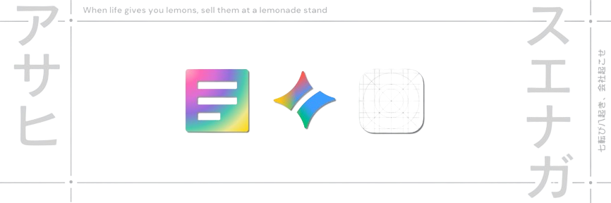

<h2 align="left">About Me</h2>

  <picture>
    <source media="(prefers-color-scheme: dark)" srcset="https://readme-typing-svg.herokuapp.com?font=Fira+Code&color=FFFFFF&size=45&center=true&vCenter=true&width=800&height=80&lines=Hey+there!+👋+I'm+Asahi;Computer+Science+Student;Michigan+State+University">
    
  </picture>

<h2 align="left">Technologies & Lanuages</h2>

<h3 align="left">Languages</h3>

<!--  -->

<h3 align="left">Technologies</h3>

<!--  -->
<!--  -->

<h3 align="left">IDEs</h3>

<!---  -->
<!---  -->

<h2 align="left">Statistics</h2>

